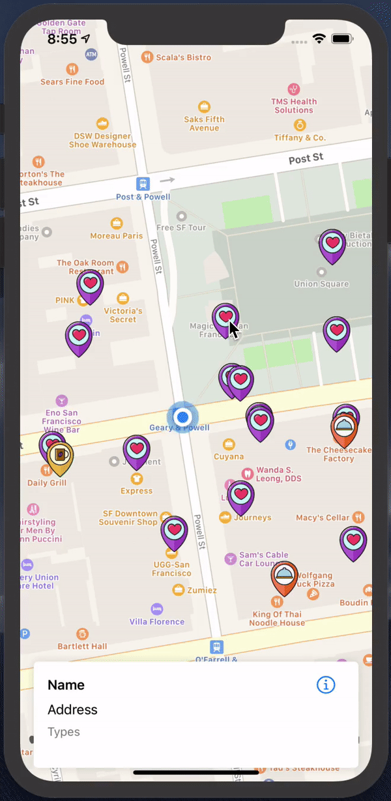

# MapsDirectionForGooglePlaces
Maps using the MapKit framework from Apple. We can draw annotation pins on the map, display the user's location, display directions between different places, and integrate the Google Places SDK.

  

